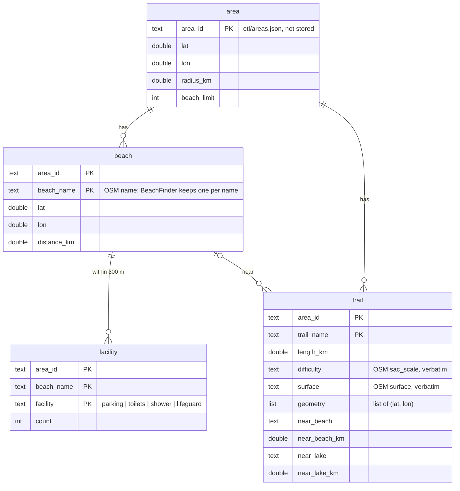
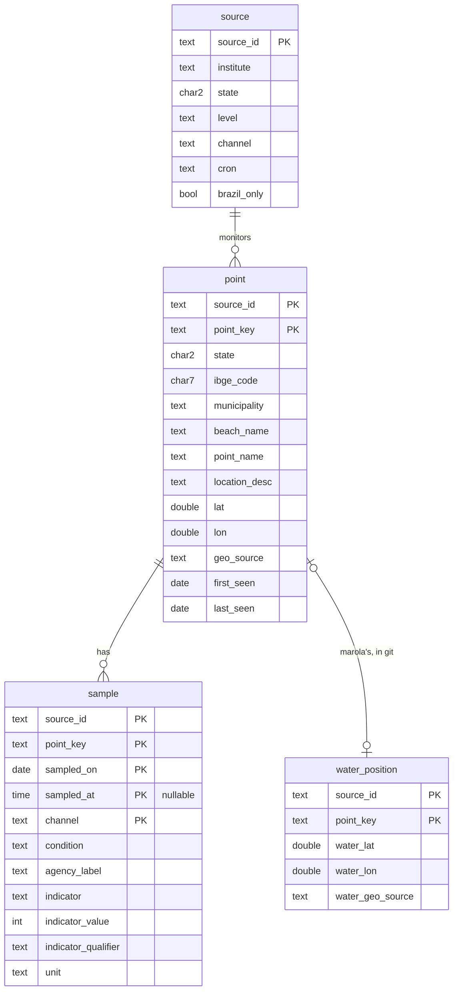

# Data model: a DuckLake on Backblaze B2

The store is one DuckLake: tables whose rows live in Parquet files in the bucket
`br-open-ocean-data-storage`, and a catalog that records every table, file and snapshot. Nothing
runs between loads. [contracts/views.sql](contracts/views.sql) is the read side in DuckDB SQL,
stored in the catalog as views, and [contracts/checks.sql](contracts/checks.sql) its executable
acceptance checks. Column-by-column mapping to the Praia Limpa dictionary:
[research R5](research.md#r5-column-names-mip-0056s-with-the-praia-limpa-field-mapped).

## The bucket's tree

```text
s3://br-open-ocean-data-storage/
  catalog/oods.ducklake                        the DuckLake catalog (a DuckDB file): tables, files, snapshots
  lake/main/<table>/…/ducklake-<uuid>.parquet  every row; written and named by DuckLake, never by hand
  lake/main/sample/source_id=<id>/year=YYYY/   sample's partitions
  exports/beaches/<BeachSnapshot.key>.json     BeachSnapshot v1, one per area: the build's read (MAROLA_BEACHES_DIR)
  exports/water-quality/<source_id>.json       CachedWaterQualityClient v1, water positions joined (MAROLA_WATER_CACHE_DIR)
```

The Parquet files under `lake/` are only meaningful through the catalog: an update or delete adds
a delete file beside the data file, so reading `lake/` with a plain `read_parquet` glob gives
wrong rows. Readers attach the lake, or read the exports. The exports are rewritten only after the
catalog upload succeeds, so the build never reads data the catalog does not have.

`exports/beaches/` is named by `BeachSnapshot.key(origin, radius, limit)`
(`m27.6000_m48.4800_r30.0_n80.json` for floripa), so the file is found by the same key the app
already computes, and a changed radius cannot silently reuse a stale list.

## Tables

| Table | One row is | Key | Written by | Rows |
|---|---|---|---|---|
| `beach` | a named beach in an area | `(area_id, beach_name)` | beach ETL, from `BeachFinder.nearby` | ≤ 80 per area, ~200 |
| `facility` | a facility kind at a beach, count > 0 | `(area_id, beach_name, facility)` | beach ETL, from `OverpassAccessibilityClient.near` | ~400 |
| `trail` | a named trail | `(area_id, trail_name)` | beach ETL, from `TrailFinder.nearby` | ~100 |
| `source` | an agency publication | `source_id` | the ETL, mirrored from `etl/sources.json` | 3 |
| `point` | a monitoring spot | `(source_id, point_key)` | water-quality ETL | ~685 |
| `sample` | a result at a point on a date from a channel; partitioned by `source_id`, `year(sampled_on)` | `(source_id, point_key, sampled_on, sampled_at, channel)`, NULL time equal to NULL | water-quality ETL | ~190k with SC history |
| `water_position` | marola's in-water position | `(source_id, point_key)` | the ETL, mirrored from `etl/water-positions.csv` (git, a person, reviewed PRs) | tens |
| `fetch_partition` | one unit of fetch work (an IMA/SC beach-year) | `(source_id, partition_key)` | water-quality ETL, after the partition commits | ~3,400 for SC |
| `fetch_run` | one execution of one area or source | `(job, started_at)` | both ETLs, always, even on failure | +6/week |

DuckLake has no primary keys or checks. `oods check` refuses a batch with a duplicate key or a
value outside its vocabulary before it is committed (FR-017, `checks.sql`).

## Beach registry (US1)



No OSM id is kept: `Beach` has none, and `BeachFinder` already merges node, way and relation by
name. The tables mirror OSM; the lake's snapshots keep the earlier state for 30 days
([research R9](research.md#r9-snapshots-and-the-bucket-lifecycle)).

## Water-quality registry (US2–US5)



## Views (`views.sql`)

| View | One row per | Use |
|---|---|---|
| `sample_dedup` | (point, date, time) | channel precedence `csv > pdf > json > rest` |
| `latest_per_point` | point | the newest deduplicated sample; feeds `exports/water-quality/<source>.json` |
| `point_fitness` | point with samples | `proper_count / classified_count` over the last 5 |
| `beach_point` | point | the flat, Praia Limpa-shaped record; `where state = 'SC'` |
| `beach_card` | beach | a beach with its facility counts and trail count |

## Ledger tables

| `fetch_partition` column | Meaning |
|---|---|
| `source_id`, `partition_key` | `ima-sc`, `campeche/2025` |
| `content_hash` | sha256 over the partition's parsed rows sorted by key, so a re-fetch that changes nothing is recognised |
| `immutable` | false while the year can still change (current year; the previous one while `today − 45 d` falls in it) |
| `fetched_at`, `rows` | when, and how many rows it gave |

| `fetch_run` column | Meaning |
|---|---|
| `job`, `started_at` | `beaches-floripa` or `ima-sc`, and when it began |
| `mode`, `outcome` | `incremental`/`backfill`; `new_bulletin`, `no_new_bulletin`, `unchanged`, `partial`, `failed` |
| `finished_at`, `requests`, `rows_changed`, `snapshot_id`, `error`, `key_name` | what it did, the DuckLake snapshot it committed (null when nothing changed), and which key wrote it |

DuckLake's own `ducklake_snapshots()` lists every commit with what it changed; `fetch_run` adds
what DuckLake cannot know: the requests, the outcome and the error.

## Enumerations (labels are the stored values)

Each crosses the storage boundary, so each Scala enum gets `label`/`fromLabel`, never
`toString`/`ordinal`; `oods check` lists exactly the labels.

| Field | Labels | Scala |
|---|---|---|
| `facility.facility` | `parking`, `toilets`, `shower`, `lifeguard` | `Facility` (exists; gains `label`) |
| `sample.condition` | `propria`, `impropria`, `unknown` | `BathingCondition` (exists, `label` exists) |
| `sample.indicator` | `e_coli`, `enterococci`, `thermotolerant_coliforms`, `unknown` | `Indicator` |
| `sample.indicator_qualifier` | `exact`, `below`, `above` | `Qualifier` |
| `sample.unit` | `NMP/100mL`, `UFC/100mL` | `CountUnit` |
| `sample.channel`, `source.channel` | `csv`, `pdf`, `json`, `arcgis`, `powerbi`, `kmz`, `html` | `Channel` |
| `point.geo_source` | `feed`, `curated`, `none` | `GeoSource` |
| `source.level` | `state`, `municipal` | `SourceLevel` |
| run `mode` | `incremental`, `backfill` | `Mode` |
| run `outcome` | `new_bulletin`, `no_new_bulletin`, `unchanged`, `partial`, `failed` | `RunOutcome` |

## Scala rows (marola-app `oods`)

```scala
final case class BeachRow(areaId: AreaId, beachName: String, position: LatLon, distanceKm: Double)
final case class FacilityRow(areaId: AreaId, beachName: String, facility: Facility, count: Int)
final case class TrailRow(areaId: AreaId, trailName: String, lengthKm: Double, difficulty: Option[String],
    surface: Option[String], geometry: Chunk[LatLon], nearBeach: Option[(String, Double)],
    nearLake: Option[(String, Double)])

final case class PointRow(
    sourceId: SourceId, pointKey: PointKey, state: Uf, ibgeCode: Option[IbgeCode],
    municipality: String, beachName: String, pointName: String, locationDesc: Option[String],
    position: Option[LatLon], geoSource: GeoSource)  // no water_* field: no adapter can produce one
```

MIP-0056 §5.2's `SampleRow` gains `agencyLabel: Option[String]` and `unit: Option[CountUnit]`.
`Uf`, `IbgeCode`, `AreaId` and `LatLon` are opaque types with smart constructors (two letters;
seven digits; `[a-z-]+`; inside Brazil's box), so the checks `oods check` runs fail first in the
adapter's unit test, with the row that broke them.

## Lifecycles

- **Beach, facility, trail**: per area, one transaction updates the rows whose columns differ,
  inserts new keys and deletes keys OSM no longer has; nothing changes when OSM didn't. A shrink
  below half the stored beach count is refused (US1.5).
- **Point**: inserted the first time an adapter sees it (`first_seen`); every later sighting moves
  `last_seen` and updates changed agency columns. Never dropped by the ETL.
- **Sample partition**: `immutable = false` while its year can still change (current year, and the
  previous one while `today − 45 days` falls in it); an immutable partition with a matching hash
  is skipped without a request. Its samples are upserted like the beaches.
- **Fetch run**: inserted as `failed` with `finished_at = null` in its own transaction at start,
  updated once at the end. The catalog upload runs even when the job fails, so a failed run is
  on record; only a runner lost mid-job leaves none (GitHub's own run log still shows it).
- **Snapshots**: kept 30 days, then expired, and the files only they referenced deleted
  (`ducklake_expire_snapshots`, `ducklake_cleanup_old_files`), as the last step of each job.
