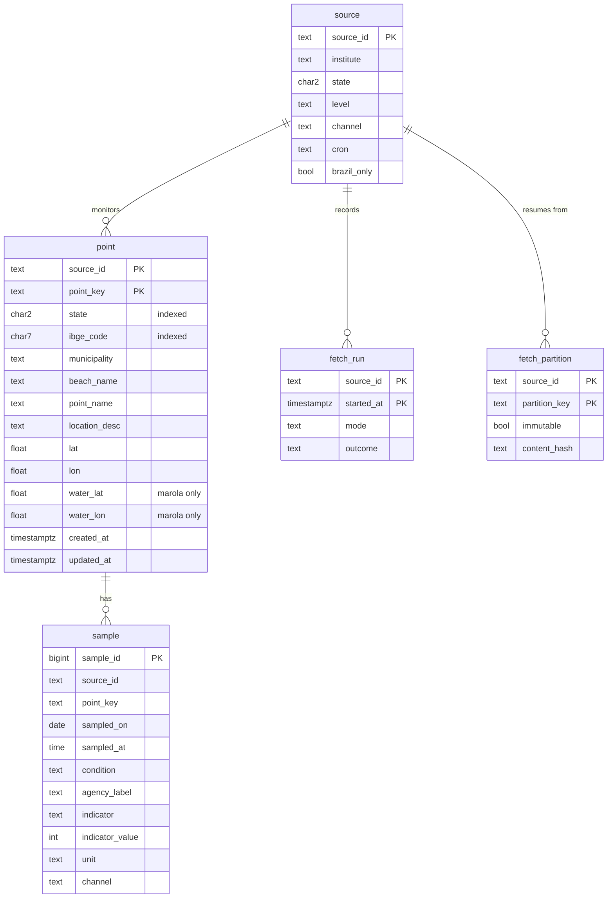

# Data model: Beach persistence in Supabase

The DDL is [contracts/schema.sql](contracts/schema.sql); this page is the reading guide. Every
table lives in the `oods` schema. Column-by-column mapping to the Praia Limpa dictionary:
[research.md R3](research.md#r3-column-names-mip-0056s-with-the-praia-limpa-field-mapped).



## Tables

| Table | One row is | Key | Written by | Rows (SC+RJ+BA) |
|---|---|---|---|---|
| `source` | an agency publication | `source_id` | `oods migrate` seed, then a person | 3 |
| `point` | a monitoring spot | `(source_id, point_key)` | ETL (agency columns), a person (`water_*`) | ~685 |
| `sample` | a result at a point on a date from a channel | `sample_id`; unique `(source_id, point_key, sampled_on, sampled_at, channel)` nulls not distinct | ETL | ~190k with SC history |
| `fetch_run` | one execution of one source | `(source_id, started_at)` | ETL, always, even on failure | +3/week |
| `fetch_partition` | one unit of fetch work | `(source_id, partition_key)` | ETL, after a partition commits | ~3,400 for SC |

## Views (all `security_invoker`)

| View | One row per | Use |
|---|---|---|
| `sample_dedup` | (point, date, time) | channel precedence `csv > pdf > json > rest` |
| `latest_per_point` | point | the newest deduplicated sample; the map's export |
| `point_fitness` | point with samples | `proper_count / classified_count` over the last 5 |
| `beach_point` | point | the flat, Praia Limpa-shaped record; `where state = 'SC'` |

## Enumerations (labels are the stored values)

Each crosses the database boundary, so each Scala enum gets `label`/`fromLabel`, never
`toString`/`ordinal`; the column's `check` lists exactly the labels.

| Column | Labels | Scala |
|---|---|---|
| `sample.condition` | `propria`, `impropria`, `unknown` | `BathingCondition` (exists, `label` exists) |
| `sample.indicator` | `e_coli`, `enterococci`, `thermotolerant_coliforms`, `unknown` | `Indicator` (MIP-0056 + #1) |
| `sample.indicator_qualifier` | `exact`, `below`, `above` | `Qualifier` |
| `sample.unit` | `NMP/100mL`, `UFC/100mL` | `CountUnit` |
| `sample.channel`, `source.channel` | `csv`, `pdf`, `json`, `arcgis`, `powerbi`, `kmz`, `html` | `Channel` |
| `point.geo_source` | `feed`, `curated`, `none` | `GeoSource` |
| `source.level` | `state`, `municipal` | `SourceLevel` |
| `fetch_run.mode` | `incremental`, `backfill` | `Mode` |
| `fetch_run.outcome` | `new_bulletin`, `no_new_bulletin`, `partial`, `failed` | `RunOutcome` |

## Scala rows (marola-app `oods`)

MIP-0056 §5.2's `SampleRow` gains `agencyLabel: Option[String]` and `unit: Option[CountUnit]`;
`PointRow` carries the agency columns only, so no adapter can produce a `water_*` value:

```scala
final case class PointRow(
    sourceId: SourceId, pointKey: PointKey, state: Uf, ibgeCode: Option[IbgeCode],
    municipality: String, beachName: String, pointName: String, locationDesc: Option[String],
    position: Option[LatLon], geoSource: GeoSource)
```

`Uf`, `IbgeCode` and `LatLon` are opaque types with smart constructors (two letters; seven
digits; inside Brazil's box), so the checks the database enforces fail first in the adapter's
unit test, with the row that broke them.

## Lifecycles

- **Point**: inserted the first time an adapter sees it (`first_seen`); every later sighting
  moves `last_seen` and updates changed agency columns. Never deleted by the ETL: a point the
  agency stops reporting keeps its history and stops moving `last_seen`.
- **Sample**: inserted once; updated only when the agency revises it (IMA's current-year CSV),
  guarded by `is distinct from`. Deleted only by retention (`--keep-samples N > 0`).
- **Fetch partition**: `immutable = false` while its year can still change (current year, and the
  previous one while `today − 45 days` falls in it); an immutable partition with a matching hash
  is skipped without a request.
- **Fetch run**: inserted at start with `outcome = 'failed'` and `finished_at = null`, then
  updated once at the end. A crashed job therefore leaves a `failed` row, never none. The ETL
  role may update only those closing columns.
