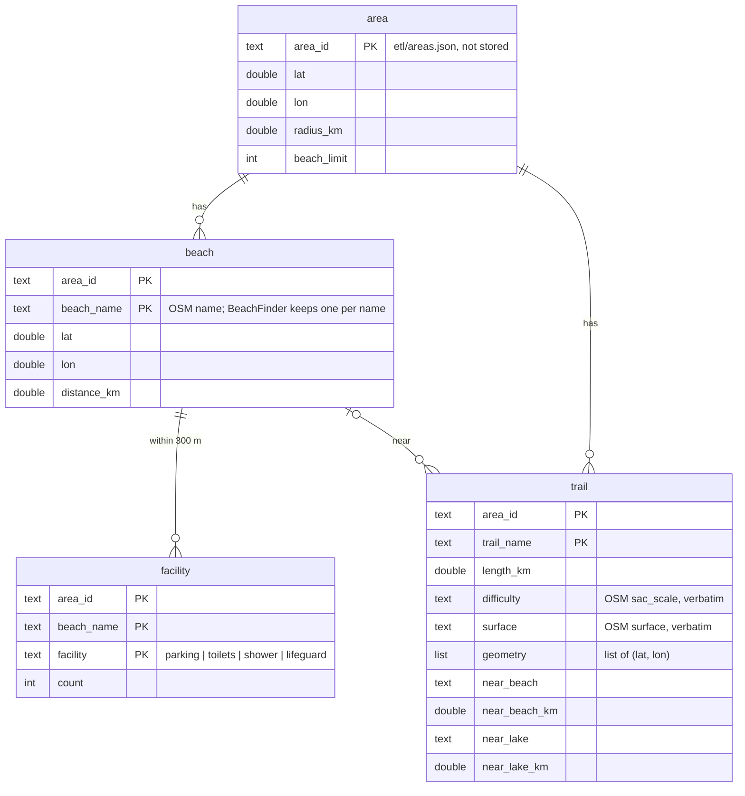
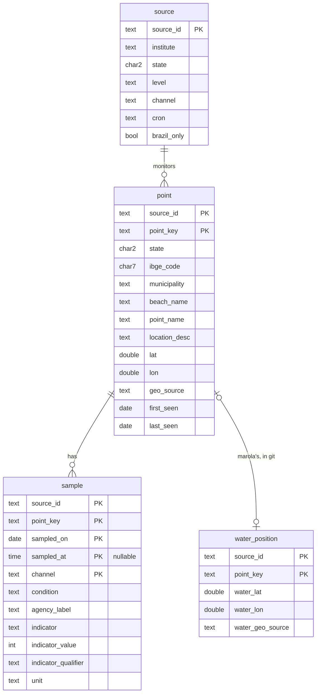

# Data model: the store on Backblaze B2

Everything lives in the bucket `br-open-ocean-data-storage` as Parquet or JSON; nothing is a
table in a server. [contracts/views.sql](contracts/views.sql) is the read side in DuckDB SQL, and
[contracts/checks.sql](contracts/checks.sql) its executable acceptance checks. Column-by-column
mapping to the Praia Limpa dictionary: [research R5](research.md#r5-column-names-mip-0056s-with-the-praia-limpa-field-mapped).

## The bucket's tree

```text
s3://br-open-ocean-data-storage/
  beaches/                                     the beach ETL (US1)
    <area_id>/beaches.parquet
    <area_id>/facilities.parquet
    <area_id>/trails.parquet
    latest/<BeachSnapshot.key>.json            BeachSnapshot v1: the build's one read (MAROLA_BEACHES_DIR)
    manifest/<area_id>.json                    per object: content hash, rows, written_at
  water-quality/                               the water-quality ETL (US2–US5)
    sources.json                               the registry, from etl/sources.json
    <source_id>/points.parquet
    <source_id>/samples/year=YYYY/samples.parquet
    latest/<source_id>.json                    CachedWaterQualityClient v1, water positions joined (MAROLA_WATER_CACHE_DIR)
    manifest/<source_id>.json                  per partition: content hash, rows, written_at; the resume ledger
  runs/<job>/<started_at>.json                 one record per run; job = beaches-<area_id> or <source_id>
```

The two ETLs share nothing but the bucket, the store code and `runs/`. `beaches/latest/` is
named by `BeachSnapshot.key(origin, radius, limit)` (`m27.6000_m48.4800_r30.0_n80.json` for
floripa), so the file is found by the same key the app already computes, and a changed radius
cannot silently reuse a stale list.

## Beach registry (US1)



| File | One row is | Key | From | Rows (3 areas) |
|---|---|---|---|---|
| `beaches.parquet` | a named beach | `(area_id, beach_name)` | `BeachFinder.nearby` | ≤ 80 per area, ~200 |
| `facilities.parquet` | a facility kind at a beach, count > 0 | `(area_id, beach_name, facility)` | `OverpassAccessibilityClient.near` | ~400 |
| `trails.parquet` | a named trail | `(area_id, trail_name)` | `TrailFinder.nearby` | ~100 |

No OSM id is kept: `Beach` has none, and `BeachFinder` already merges node, way and relation by
name. The registry is a weekly snapshot of OSM, not a history (B2's kept versions are the
rollback, [research R9](research.md#r9-object-versions-and-the-lifecycle-rule)).

## Water-quality registry (US2–US5)



| Object | One row is | Key | Written by | Rows (SC+RJ+BA) |
|---|---|---|---|---|
| `sources.json` | an agency publication | `source_id` | the ETL, copied from `etl/sources.json` | 3 |
| `<source>/points.parquet` | a monitoring spot | `(source_id, point_key)` | ETL | ~685 |
| `<source>/samples/year=YYYY/` | a result at a point on a date from a channel | `(source_id, point_key, sampled_on, sampled_at, channel)`, NULL time equal to NULL | ETL | ~190k with SC history |
| `etl/water-positions.csv` (git, this repo) | marola's in-water position | `(source_id, point_key)` | a person, in a reviewed PR | tens |

Keys are not enforced by the store: `oods check` refuses a partition with a duplicate key before
it is uploaded (FR-017, `checks.sql`).

## Views (`views.sql`)

| View | One row per | Use |
|---|---|---|
| `sample_dedup` | (point, date, time) | channel precedence `csv > pdf > json > rest` |
| `latest_per_point` | point | the newest deduplicated sample; feeds `latest/<source>.json` |
| `point_fitness` | point with samples | `proper_count / classified_count` over the last 5 |
| `beach_point` | point | the flat, Praia Limpa-shaped record; `where state = 'SC'` |
| `beach_card` | beach | a beach with its facility counts and trail count |

## Manifest and run record

```json
{ "version": 1, "job": "ima-sc",
  "objects": { "samples/year=2025/samples.parquet":
               { "sha256": "…", "rows": 8132, "immutable": true, "written_at": "2026-10-11T12:21:07Z" } } }
```

```json
{ "version": 1, "job": "beaches-floripa", "mode": "incremental",
  "started_at": "2026-10-10T12:17:03Z", "finished_at": "2026-10-10T12:18:41Z",
  "outcome": "unchanged", "requests": 3, "objects_written": 0, "rows": { "beach": 80, "facility": 151, "trail": 37 },
  "error": null }
```

`sha256` is over the object's rows sorted by key, not over the Parquet bytes, so a DuckDB upgrade
that changes the encoding does not rewrite every partition ([research R4](research.md#r4-write-order-is-the-transaction)).

## Enumerations (labels are the stored values)

Each crosses the storage boundary, so each Scala enum gets `label`/`fromLabel`, never
`toString`/`ordinal`; `oods check` lists exactly the labels.

| Field | Labels | Scala |
|---|---|---|
| `facility.facility` | `parking`, `toilets`, `shower`, `lifeguard` | `Facility` (exists; gains `label`) |
| `sample.condition` | `propria`, `impropria`, `unknown` | `BathingCondition` (exists, `label` exists) |
| `sample.indicator` | `e_coli`, `enterococci`, `thermotolerant_coliforms`, `unknown` | `Indicator` |
| `sample.indicator_qualifier` | `exact`, `below`, `above` | `Qualifier` |
| `sample.unit` | `NMP/100mL`, `UFC/100mL` | `CountUnit` |
| `sample.channel`, `source.channel` | `csv`, `pdf`, `json`, `arcgis`, `powerbi`, `kmz`, `html` | `Channel` |
| `point.geo_source` | `feed`, `curated`, `none` | `GeoSource` |
| `source.level` | `state`, `municipal` | `SourceLevel` |
| run `mode` | `incremental`, `backfill` | `Mode` |
| run `outcome` | `new_bulletin`, `no_new_bulletin`, `unchanged`, `partial`, `failed` | `RunOutcome` |

## Scala rows (marola-app `oods`)

```scala
final case class BeachRow(areaId: AreaId, beachName: String, position: LatLon, distanceKm: Double)
final case class FacilityRow(areaId: AreaId, beachName: String, facility: Facility, count: Int)
final case class TrailRow(areaId: AreaId, trailName: String, lengthKm: Double, difficulty: Option[String],
    surface: Option[String], geometry: Chunk[LatLon], nearBeach: Option[(String, Double)],
    nearLake: Option[(String, Double)])

final case class PointRow(
    sourceId: SourceId, pointKey: PointKey, state: Uf, ibgeCode: Option[IbgeCode],
    municipality: String, beachName: String, pointName: String, locationDesc: Option[String],
    position: Option[LatLon], geoSource: GeoSource)  // no water_* field: no adapter can produce one
```

MIP-0056 §5.2's `SampleRow` gains `agencyLabel: Option[String]` and `unit: Option[CountUnit]`.
`Uf`, `IbgeCode`, `AreaId` and `LatLon` are opaque types with smart constructors (two letters;
seven digits; `[a-z-]+`; inside Brazil's box), so the checks `oods check` runs fail first in the
adapter's unit test, with the row that broke them.

## Lifecycles

- **Beach, facility, trail**: replaced as a whole per area each week when the hash differs. A
  shrink below half the stored beach count is refused (US1.5).
- **Point**: inserted the first time an adapter sees it (`first_seen`); every later sighting moves
  `last_seen` and updates changed agency columns. Never dropped by the ETL.
- **Sample partition**: `immutable = false` while its year can still change (current year, and the
  previous one while `today − 45 days` falls in it); an immutable partition with a matching hash
  is skipped without a request. Rewritten whole when its hash changes.
- **Run record**: written as `failed` with `finished_at = null` at start, overwritten once at the
  end. A crashed job therefore leaves a `failed` record, never none.
