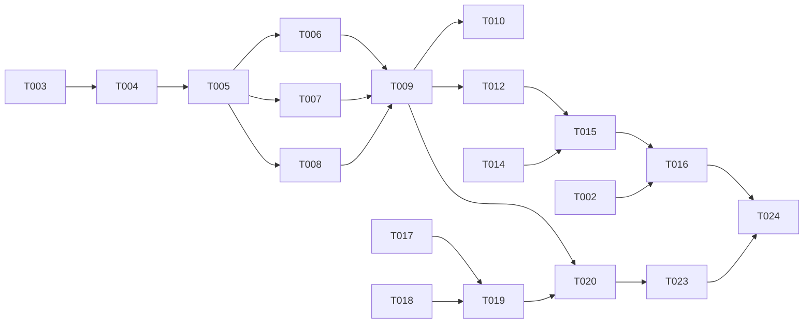

# Tasks: a DuckLake on Backblaze B2, beaches first

**Input**: [plan.md](plan.md), [spec.md](spec.md), [research.md](research.md),
[data-model.md](data-model.md), [contracts/](contracts/).

spec-kit's file set, marola's task shape (MIP-0063 §4.7): one row per task, ids `001-T0NN` so they
survive `tasks-to-issues`, an explicit `depends on` column, and once a task is an issue the issue
owns its status. `[P]` = can run in parallel with the other `[P]` rows of its phase. `Story` maps
to the spec's user stories. Each code task is one PR with its tests; "repo" says where it lands.

## Phase 0: gates (people, not agents)

| Id | Task | Repo | Story | Depends on |
|---|---|---|---|---|
| 001-T001 | ~~Create the B2 account, bucket and ETL key; set `BACKBLAZE_ETL_APP_KEY`, `BACKBLAZE_ETL_KEY_ID`, `BACKBLAZE_ETL_KEY_NAME`~~ (done 2026-10-05) | — (person) | all | — |
| 001-T002 | Run the bucket smoke test ([quickstart B](quickstart.md#b-the-hosted-bucket-smoke-test)); set the lifecycle to keep only the last version (research R9) | — (person) | all | 001-T001 |
| 001-T003 | Revise and accept [MIP-0075](https://github.com/marola-dev/marola/blob/main/docs/MIPs/MIP-0075-water-quality-store-r2.md) for B2 and beaches first; its §11 holds the Phase 2 exception | marola (umbrella) | all | — |
| 001-T004 | File the tasks below as issues and label the first ones `agent-ready` | marola-app, marola-oods | all | 001-T003 |

## Phase 1: the store (foundational, blocks every story)

| Id | Task | Repo | Story | Depends on |
|---|---|---|---|---|
| 001-T005 | `oods` sbt module (`dependsOn(local)`), `cli dependsOn(oods)`; `duckdb_jdbc` 1.5.6.0; empty `marola.oods.Main` with usage and exit code 2 | marola-app | — | 001-T004 |
| 001-T006 | The image bakes `ducklake` and `httpfs` for the pinned DuckDB and loads them from files with autoinstall off; a smoke step in `docker-smoke.yml` loads both offline and attaches a local lake | marola-app | — | 001-T005 |
| 001-T007 [P] | `model/`: the rows of data-model.md, every enum with `label`/`fromLabel` (`Facility` gains one), opaque `Uf`, `IbgeCode`, `AreaId`, `LatLon`; a test over each enum's `values`: `fromLabel(label(x)) == Some(x)` | marola-app | US1, US2 | 001-T005 |
| 001-T008 [P] | `OodsS3Config` from `OODS_*` (redacted `toString`, exit 2 on a missing one); the DDL of data-model.md's tables (with `sample`'s partitioning), `views.sql` and the `oods check` queries as resources, = contracts/ | marola-app | US1 | 001-T005 |
| 001-T009 | `OodsStore` trait (per-area and per-partition upsert in one transaction, `knownPartitions`, `openRun`/`closeRun`, `export`, `maintain`) + `DuckLakeStore` (session `TYPE s3` secret, `ATTACH 'ducklake:$OODS_CATALOG'` with `DATA_PATH` and inlining off, the three upsert statements of research R4, creates the tables and views on a new catalog); runs on a local lake in tests | marola-app | US1, US6 | 001-T006, 001-T007, 001-T008 |
| 001-T010 | `DuckLakeStoreIT`: MinIO in Testcontainers, tag `Integration`, excluded from `just test`; a CI job running it: insert, update, delete, no snapshot on a no-op, time travel, rollback, expire and cleanup, a catalog closed and re-attached | marola-app | US1 | 001-T009 |
| 001-T011 [P] | This repo's CI runs `contracts/checks.sql` on DuckDB, plain and inside a local DuckLake (green now, red when `point_fitness` counts unknowns) | marola-oods | US3 | — |

## Phase 2: US1, the beach ETL (MVP)

| Id | Task | Repo | Story | Depends on |
|---|---|---|---|---|
| 001-T012 | `BeachLoad` + `oods beaches`: per area, `BeachFinder.nearby(snapshots = None)`, `OverpassAccessibilityClient.near`, `TrailFinder.nearby` → rows → `oods check` → one transaction on `beach`, `facility`, `trail` → `fetch_run`; `oods export` writes `exports/beaches/<BeachSnapshot.key>.json` (via `BeachSnapshot.encode`); `partial` when only facilities/trails fail; `SuspiciousShrink` under half | marola-app | US1, US6 | 001-T009 |
| 001-T013 | `BeachLoadSpec`: captured Overpass answers through `Http.withTransport` → exact rows and a snapshot `BeachSnapshot.decode` reads back; run twice → `unchanged`, no new snapshot; all mirrors 504 → `failed`, rolled back; trails 429 → `partial`, beaches written; shrink refused | marola-app | US1 | 001-T012 |
| 001-T014 [P] | `etl/areas.json` (floripa, rio, salvador, values copied from marola-site's `site/areas.json`) and its shape check | marola-oods | US1 | — |
| 001-T015 | `beach-etl.yml` per contracts/workflow.md: Monday cron, dispatch by area, the `oods-lake` concurrency group, the catalog download / load / maintain / upload (always) / export steps, `BACKBLAZE_ETL_*` mapped to `OODS_S3_*`; actionlint clean | marola-oods | US1 | 001-T012, 001-T014 |
| 001-T016 | Bump `marola-image` to the first image with `marola.oods.Main`; dispatch `beach-etl.yml` `area=all`, twice; record rows, snapshots, catalog size and seconds in the PR | marola-oods | US1 | 001-T002, 001-T015 |

**Checkpoint**: every area's beaches, facilities and trails are in the bucket, a weekly run
rewrites only what OSM changed, and a second run writes nothing.

## Phase 3: US2 + US3 + US6, SC water quality

| Id | Task | Repo | Story | Depends on |
|---|---|---|---|---|
| 001-T017 [P] | `Planner` (pure): partitions per source/state/years, mutability rule (current year; previous while `today − 45 d` in it), skip immutable + matching hash; unknown UF is an error | marola-app | US2 | 001-T007 |
| 001-T018 [P] | `Throttle`: ≥ 250 ms per host, ≤ 4 in flight, 3 attempts with backoff on 5xx/timeout, stop on 429/403; fake clock + recording `Http.Transport` in its spec | marola-app | US2 | 001-T005 |
| 001-T019 | `ImaScAdapter`: incremental from `/relatorio/mapa` (reusing `ImaScWaterQualityClient.parse`'s field handling), backfill from CSV per beach-year (fixtures in `oods/src/test/resources/ima-sc/`); `e_coli`, `NMP/100mL`, `<20` → 20 + `below`; spec from captured payloads to exact rows | marola-app | US2 | 001-T017, 001-T018 |
| 001-T020 | `Load` + `oods load`: plan → fetch → parse → check → one transaction per partition batch on `point` and `sample` + its `fetch_partition` rows → `fetch_run`; `oods export` writes `exports/water-quality/<source>.json` (CachedWaterQualityClient v1, from `latest_per_point`); `--dry-run`, `--max-minutes` → `partial`; per-source stderr line; exit codes | marola-app | US2, US3, US6 | 001-T009, 001-T019 |
| 001-T021 | `LoadSpec` on a local lake: run twice → second changes no row and makes no snapshot; 5xx → `failed`, rolled back; 429 → stops, no retry; killed mid-backfill → resume skips committed partitions | marola-app | US2, US6 | 001-T020 |
| 001-T022 | `etl/sources.json` (`ima-sc` only) and its shape check; `oods status` reads `fetch_run` and `beach_point` | marola-oods, marola-app | US2, US3, US6 | 001-T020 |
| 001-T023 | `water-quality-etl.yml` per contracts/workflow.md, SC only: `plan` → `load` matrix with `max-parallel: 1`, the `oods-lake` group, the catalog steps, timeout; actionlint clean | marola-oods | US2 | 001-T020, 001-T022 |
| 001-T024 | Dispatch the SC backfill; record requests, partitions, MB and minutes in the PR | marola-oods | US2 | 001-T016, 001-T023 |

**Checkpoint**: SC is in the bucket with its history, a weekly run adds only what is new, and a
second run writes nothing.

## Phase 4: US4, marola's water positions

| Id | Task | Repo | Story | Depends on |
|---|---|---|---|---|
| 001-T025 | `etl/water-positions.csv` with its CI check (all three set or none, inside Brazil's box); `--water-positions` mirrored into `water_position`, so `beach_point` and the exports join it; the first reviewed positions for points whose agency position is on land, each with its evidence | marola-oods, marola-app | US4 | 001-T020 |

## Phase 5: US5, RJ and BA (needs the Brazil proxy)

| Id | Task | Repo | Story | Depends on |
|---|---|---|---|---|
| 001-T026 | A person provisions the proxy VM and `MAROLA_BR_PROXY` (#1 comment), and confirms its cost | — (person) | US5 | — |
| 001-T027 [P] | `IneaRjAdapter`: city page → zones ≤ 45 days → PDFs → `IneaPdfParser`; curated coords; uncurated codes kept with `geo_source = 'none'`; `enterococci`, filename date | marola-app | US5 | 001-T020 |
| 001-T028 [P] | `InemaBaAdapter`: newest campaign (not the pinned 83453), `InemaPdfParser`, curated coords; the date rule of US5.3 | marola-app | US5 | 001-T020 |
| 001-T029 | Proxy routing for `brazil_only` hosts only (B2 direct); `scripts/br-proxy.sh` in the workflow; RJ (Fri) and BA (Sat) in `sources.json` and the schedule | marola-oods | US5 | 001-T026, 001-T027, 001-T028 |

## Phase 6: polish

| Id | Task | Repo | Story | Depends on |
|---|---|---|---|---|
| 001-T030 | Facility and trail snapshot readers next to `BeachSnapshot` (same `MAROLA_BEACHES_DIR`), so a build with the snapshots makes no Overpass call | marola-app | US1 | 001-T012 |
| 001-T031 | A person creates the read-only key for marola-site (and marola-ml); marola-site's download is its own spec (#1 §3) | — (person) | — | 001-T016 |
| 001-T032 | AGENTS.md, README and docs/3-development.md here: the two workflows, their secrets and variables, that they never write this repo | marola-oods | — | 001-T015 |
| 001-T033 | Optional: backfill self-chaining with `GITHUB_TOKEN` (`actions: write`), capped hops | marola-oods | US2 | 001-T023 |

## Dependencies in short

MVP = Phase 0 + 1 + 2: the beach ETL. Everything after can ship one task at a time.
